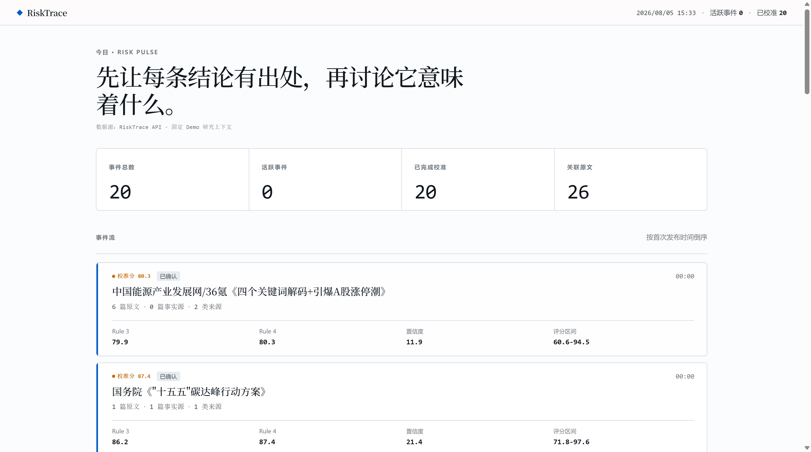
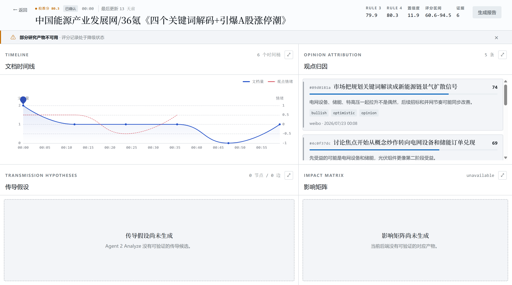

<p align="center">
  
</p>

<h1 align="center">RiskTrace</h1>

<p align="center">
  <strong>让金融事件、市场观点与风险评分都能回到证据。</strong><br>
  面向证券研究与风险研究团队的可追溯研究工作台。
</p>

<p align="center">
  
  
  
  
  <a href="LICENSE"></a>
</p>

RiskTrace 将突发事件后的信息浏览压缩为一条可复核链路：统一接入来源材料，按确定性规则形成事件与评分，再把观点、传导候选和原始证据组织进同一个研究界面。它不提供自动交易，不把时间相关性写成因果关系，也不构成投资建议。

## 产品预览

<p align="center">
  
</p>

<p align="center"><sub>风险总览：从固定 Demo 研究上下文读取事件、Rule 3/4 评分与来源统计。</sub></p>

<p align="center">
  
</p>

<p align="center"><sub>事件工作台：已生成的研究产物正常展示；缺失的传导与影响矩阵明确标记为未生成。</sub></p>

## 为什么是 RiskTrace

| 能力 | 当前实现 |
| --- | --- |
| 统一来源契约 | `POST /api/v1/ingestion/items` 校验严格 `SourceRecord`；租户和 provider scope 由服务端确定 |
| 不可变与幂等接入 | 原始文档不原地覆盖；重复投递追加 `IngestionReceipt`；冲突内容返回 HTTP 409 |
| 确定性事件与评分 | 已实现 Rule 1/2、事件去重/匹配、热度/动量、生命周期、Rule 3 与 Rule 4 校准 |
| 真实 API 驱动的 Web | 风险总览、事件工作台、时间线、评分、观点/传导只读视图与证据抽屉均读取后端 API |
| 显式降级 | 后端、证据接口或研究产物不可用时显示 degraded / unavailable，不用浏览器 mock 补齐 |
| 证据优先 | 事件、评分、观点与传导对象保留证据或计算版本边界，便于继续完成可复核闭环 |

## 架构

```text
浏览器
  → Next.js Web（同源代理与研究工作台）
  → FastAPI 模块化单体
  → PostgreSQL + pgvector / Redis / MinIO
```

系统坚持三条边界：

- 确定性程序负责可复算的事件状态、指标和评分。
- LLM 只允许输出经过 schema、实体与证据 ID 校验的语义候选，不直接改权威评分或告警级别。
- 重大结论、传导确认、对外报告和投资含义由研究员最终审批。

ECharts 与 React Flow 已分别用于工作台时间线和传导图；pgvector 已进入数据库迁移与事件中心字段。Sentence Transformers 仅作为可选 embedding 能力保留，仓库不附带模型权重，也不会在默认启动时下载模型。

## 快速开始

### 环境要求

- Node.js 22+
- npm 10+
- [uv](https://docs.astral.sh/uv/)（管理 Python 3.13 环境）
- Docker 与 Docker Compose

### 启动完整本地栈

```powershell
Copy-Item .env.example .env
docker compose up --build
```

启动后可访问：

- Web：<http://localhost:3000>
- API 文档：<http://localhost:8000/api/docs>
- 存活检查：<http://localhost:8000/api/health/live>
- 就绪检查：<http://localhost:8000/api/health/ready>
- MinIO 控制台：<http://localhost:9001>

`.env.example` 中的凭据只适用于本机开发。`/api/health/live` 仅表示 API 进程存活；数据库、Redis 与对象存储是否可用以 `/api/health/ready` 为准。

停止服务但保留数据卷：

```powershell
npm run infra:down
```

> `docker compose down -v` 会删除本地数据库、缓存和对象存储卷，不要把它当作普通停止命令。

## 仓库结构

```text
RiskTrace/
├── apps/
│   ├── api/                  FastAPI、接入流水线、事件/评分规则、迁移与测试
│   └── web/                  Next.js 桌面研究工作台
├── demo/                     历史资料转换、SourceRecord 场景与可控回放
├── docs/                     产品、架构、数据与交付基线
├── infra/pgvector/           本地 pgvector 镜像源码
├── compose.yaml              完整本地栈编排
├── LICENSE                   RiskTrace 自有代码的 MIT License
└── THIRD_PARTY_NOTICES.md    仓库内第三方源码与许可证索引
```

详细职责见 [仓库结构与运行契约](docs/05-repository-structure.md)。


## 团队

| 成员 | 负责方向 |
| --- | --- |
| 李炫良 | 架构设计 |
| 林昭漫 | 后端开发 |
| 陈泽江 | 测试 |
| 吴思霖 | 市场调研 |
| 林楠浚 | 前端设计 |

## 开源许可

Copyright © 2026 李炫良、林昭漫、陈泽江、吴思霖、林楠浚。

除文件或目录另有说明外，RiskTrace 自有代码与文档采用 [MIT License](LICENSE)。仓库内保留的 ECharts、React Flow、Sentence Transformers 与 pgvector 等第三方内容适用各自的许可证与 NOTICE，不受根目录 MIT License 重新授权。完整索引见 [第三方软件与许可证](THIRD_PARTY_NOTICES.md)。
